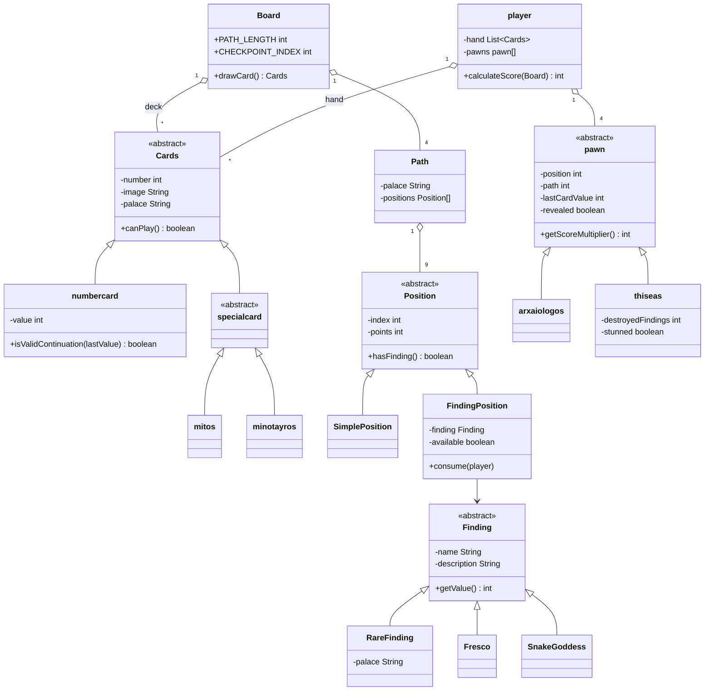
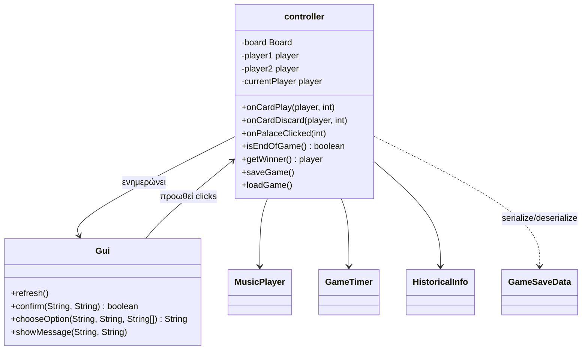

# Αναφορά Φάσης Β — "Αναζητώντας τα Χαμένα Μινωικά Ανάκτορα"

ΗΥ252, χειμερινό εξάμηνο 2024-2025

## 1. Τελική σχεδίαση

Η υλοποίηση ακολουθεί MVC:

- **Model** (`Model/*`): όλα τα δεδομένα και οι κανόνες του παιχνιδιού. Δεν
  έχει καμία εξάρτηση από Swing — δοκιμάστηκε πλήρως με JUnit χωρίς να
  ανοίξει ποτέ παράθυρο.
- **View** (`View/Gui.java`): μόνη της δουλειά είναι να ζωγραφίζει ό,τι της
  δίνει το Controller (`refresh()`) και να προωθεί τα clicks του χρήστη.
  Δεν παίρνει ποτέ απόφαση για το αν μια κίνηση είναι έγκυρη.
- **Controller** (`Controller/controller.java`): κρατάει το Board και τους
  2 players, εκθέτει `onCardPlay`, `onCardDiscard`, `onPalaceClicked`,
  `newGame`, `saveGame`, `loadGame`, ελέγχει σειρά/εγκυρότητα κινήσεων,
  ενημερώνει το view.

### 1.1 Πακέτο Model

Το `Card`/`Square` χωρίστηκαν σε ιεραρχίες με abstract βασικές κλάσεις
(`Cards`, `Position`), όπως ζητούσε η εκφώνηση, ώστε ο κοινός κώδικας
(π.χ. `getImage()`, `getPoints()`) να μην επαναλαμβάνεται στις υποκλάσεις.

### 1.2 Controller / View

## 2. Αλλαγές σε σχέση με τη Φάση Α

Η αρχική σχεδίαση της Φάσης Α είχε ήδη τις βασικές κλάσεις (`Board`,
`player`, `Cards`/`numbercard`/`minotayros`/`mitos`, `Finding` και οι 3
υποκλάσεις της, `pawn`/`arxaiologos`/`thiseas`), αλλά ένα μέρος τους ήταν
ακόμα σκελετός (πολλά method bodies ήταν κενά ή `TODO`) και δεν υπήρχε
καθόλου η έννοια της "θέσης" (`Position`) — το ταμπλό κρατούσε απλά έναν
πίνακα `int[4][9]` χωρίς καμία λογική γύρω του. Στη Φάση Β:

- Πρόσθεσα την ιεραρχία `Position` / `SimplePosition` / `FindingPosition`,
  όπως προτείνεται και στην εκφώνηση, ώστε κάθε κουτάκι να ξέρει μόνο του
  αν έχει εύρημα, ποιο είναι, και αν είναι ακόμα διαθέσιμο.
- Πρόσθεσα την ενδιάμεση abstract κλάση `specialcard` (Mitos/Minotayros),
  για να μη ξαναγράφεται η ίδια λογική (`canPlay()`) δύο φορές.
- Το `Board` δεν κρατούσε σωστά cards με Μίτο/Μινώταυρο (ήταν comment-out
  στον κώδικα της Φάσης Α, μάλλον γιατί δεν είχε ακόμα λυθεί το bug με το
  `palace` field που δεν αποθηκευόταν καθόλου στην `Cards`).
- Το `Controller` της Φάσης Α μετακινούσε ένα μόνιμα σταθερό JLabel κατά
  100px σε κάθε κλικ, χωρίς καμία σύνδεση με πραγματική θέση/κανόνες —
  αντικαταστάθηκε εντελώς από λογική που διαβάζει/γράφει το πραγματικό
  μοντέλο (`pawn.position`) και το View απλά ζωγραφίζει ό,τι διαβάζει.

## 3. Αλγόριθμοι

- **Ανακάτεμα τράπουλας**: `Collections.shuffle` πάνω στις 100 κάρτες
  (80 numbercard + 12 mitos + 8 minotayros).
- **Τοποθέτηση ευρημάτων**: πρώτα τα 4 σπάνια ευρήματα, το καθένα σε
  τυχαία από τις 5 θέσεις-ανασκαφής του δικού του ανακτόρου
  (`Board.pickFreeSlot`). Μετά τα υπόλοιπα 16 (10 αγαλματάκια + 6
  τοιχογραφίες) μπαίνουν σε μια λίστα, γίνονται shuffle και μοιράζονται
  διαδοχικά στα 16 κουτάκια που έμειναν αδειανά σε όλα τα μονοπάτια.
- **Κίνηση με Μίτο Αριάδνης**: αντί να μετακινείται απευθείας 2 θέσεις, το
  πιόνι περνάει από τη ενδιάμεση θέση (ώστε να ενεργοποιηθεί τυχόν
  ανασκαφή εκεί) και μετά προχωράει στην τελική, όπως ζητάει η
  διευκρίνιση της εκφώνησης.
- **Νικητής**: `player.calculateScore()` αθροίζει τοιχογραφίες + σπάνια
  ευρήματα + πίνακα βαθμολογίας αγαλματακίων + πόντους θέσης ανά πιόνι
  (Θησέας ×2). Σε ισοπαλία, το `controller.getWinner()` ελέγχει διαδοχικά
  σπάνια ευρήματα -> τοιχογραφίες -> αγαλματάκια, όπως ακριβώς περιγράφει
  η εκφώνηση.

## 4. Διευκρινίσεις/ερμηνείες κανόνων

Η εκφώνηση δεν λέει ρητά πότε ακριβώς "ξυπνάει" ο Θησέας μετά από επίθεση
Μινώταυρου. Το ερμήνευσα ως εξής: μένει `stunned` μέχρι να ολοκληρωθεί ο
επόμενος γύρος του ιδιοκτήτη του (δηλαδή μπλοκάρεται ακριβώς 1 γύρο), και
ξεμπλοκάρει αυτόματα στο τέλος εκείνου του γύρου (ακόμα κι αν ο γύρος
λήξει λόγω λήξης του timer).

Ο πίνακας βαθμολόγησης αγαλματακίων δίνεται στην εκφώνηση μόνο μέχρι τα 6
(0,1,2,3,4,5,6 -> 0,-20,-15,10,15,30,50). Επειδή θεωρητικά ένας παίκτης θα
μπορούσε να μαζέψει παραπάνω από 6 (υπάρχουν συνολικά 10 στο παιχνίδι), αν
συμβεί αυτό μετράει σαν να έχει ακριβώς 6 (50 πόντοι) - δεν καλύπτεται
ρητά από την εκφώνηση.

## 5. Σχεδιαστικές αποφάσεις & επίδραση στον χρήστη

- Δεξί κλικ = παίξιμο κάρτας, αριστερό κλικ = απόρριψη, όπως πρότεινε η
  εκφώνηση — αποφεύγει ένα επιπλέον κουμπί/menu για κάθε κάρτα.
- Οι επιλογές (ποιο πιόνι μπαίνει σε νέο μονοπάτι, ποιο ανάκτορο δέχεται
  επίθεση Μινώταυρου) γίνονται με `JOptionPane` input dialog αντί για
  custom UI — πιο γρήγορο να υλοποιηθεί σωστά, λίγο λιγότερο "ωραίο"
  οπτικά από ένα custom popup.
- Το ταμπλό είναι φτιαγμένο με απόλυτες συντεταγμένες πάνω σε
  `JLayeredPane` αντί για layout managers, γιατί χρειάζεται να βάλω
  πιόνια πάνω από τα κουτάκια σε ελεύθερη θέση (πολλά πιόνια στο ίδιο
  κουτάκι ταυτόχρονα).

## 6. Προβλήματα που αντιμετωπίστηκα

- Ο κώδικας της Φάσης Α είχε απόλυτα paths για τις εικόνες
  (`C:\Users\titos\Downloads\PhaseA_5200 (8)\...`) που δούλευαν μόνο στον
  υπολογιστή που τα έγραψα αρχικά — τα άλλαξα όλα σε σχετικά paths
  (`project_assets/...`) ώστε να τρέχει το πρόγραμμα από οπουδήποτε, αρκεί
  να τρέχει μέσα από τον φάκελο `src`.
- Στην `pawn` το πεδίο `idiotita` ήταν `static`, που σήμαινε ότι όλα τα
  πιόνια (και των 2 παικτών) μοιράζονταν την ίδια τιμή — έγινε instance
  πεδίο.
- Τα .wav αρχεία μουσικής που αναφέρει η εκφώνηση δεν υπήρχαν καθόλου στο
  παραδοτέο υλικό — έφτιαξα δύο μικρά placeholder κομμάτια (βλέπε
  README) ώστε να λειτουργεί η αλλαγή μουσικής ανά παίκτη, μέχρι να βρω
  τα κανονικά.
- Υπήρχαν κάποια σκόρπια πρόχειρα test αρχεία (`@Test ....java`) που δεν
  ήταν καν έγκυρη Java (χωρίς class body, mocks για πράγματα που δεν
  υπήρχαν) — τα αντικατέστησα με πραγματικά JUnit tests στο `src/Tests`.

## 7. JUnit Tests

28 tests συνολικά (`src/Tests`), όλα περνάνε:

- `NumberCardTest` — κανόνας αύξουσας σειράς/ισοβαθμίας.
- `BoardTest` — μέγεθος/σύνθεση τράπουλας, τοποθέτηση ευρημάτων (κάθε
  σπάνιο εύρημα μέσα στο δικό του ανάκτορο, 20 ευρήματα συνολικά).
- `PawnTest` — πολλαπλασιαστής σκορ Θησέα/αρχαιολόγου, όριο 3
  καταστροφών.
- `PlayerScoreTest` — υπολογισμός σκορ (τοιχογραφίες, σπάνια ευρήματα,
  πίνακας αγαλματακίων, διπλασιασμός Θησέα).
- `ControllerFlowTest` — σειρά παικτών, κανόνας αύξουσας σειράς μέσα από
  πραγματικό `onCardPlay`, επίθεση Μινώταυρου (κανονικός αρχαιολόγος /
  Θησέας / checkpoint), τέλος παιχνιδιού, νικητής.
- `SaveLoadTest` — αποθήκευση/φόρτωση διατηρεί σωστά θέση πιονιών και
  χέρι παίκτη.

Επειδή ο Controller ανοίγει πραγματικά `JOptionPane` dialogs, έφτιαξα ένα
test double (`Tests/FakeGui`) που επεκτείνει το κανονικό `Gui` και απλά
επιστρέφει προκαθορισμένες απαντήσεις αντί να δείχνει popup — έτσι τα
tests τρέχουν χωρίς να χρειάζεται κάποιος να κάθεται να πατάει ΟΚ.

## 8. Μουσική

Βλέπε README, ενότητα "Σχετικά με τη μουσική".

## 9. Τι δεν έγινε / θα μπορούσε να βελτιωθεί

- Τα γραφικά δεν έχουν δοκιμαστεί σε άλλη ανάλυση οθόνης εκτός από
  1500x1000 (absolute layout).
- Δεν έγινε animation στην κίνηση πιονιών (εμφανίζονται κατευθείαν στη
  νέα θέση).
- Το Timer (Bonus 2) δεν παίζει ήχο προειδοποίησης όταν κοντεύει να
  λήξει ο χρόνος.
